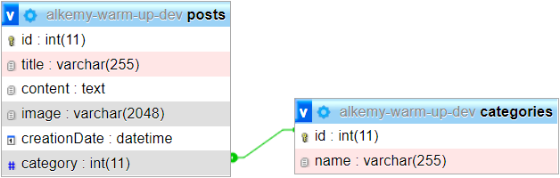

# alkemy-warm-up

Una _API_ para un blog, utilizando _Node.js_ y _Express.js_. Los datos persisten gracias a una base de datos _MySQL_, accediendola mediante _Sequelize_

## Variables de Entorno

Se necesitará un archivo `.env` en la raiz del proyecto con las siguientes variables:

- `SERVER_PORT` : Puerto que escuchará nuestro servidor
- `DATABASE_USERNAME` : Usuario con acceso a la base de datos
- `DATABASE_PASSWORD` : Contraseña del usuario
- `DATABASE_NAME` : Nombre de la base de datos
- `DATABASE_HOST` : Host donde reside la base de datos

## Modelado de Base de Datos

- Posts
  - Id
  - Titulo
  - Contenido
  - Imagen
  - Categoria
  - Fecha de creación
- Categorias
  - Id
  - Nombre

## Endpoints

Para mas información leer [Endpoints](ENDPOINTS.md).
